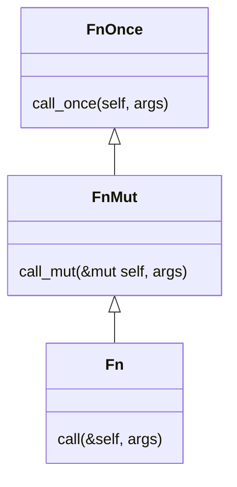

# Appendix B: Closures - Fn, FnMut, FnOnce Traits

This document covers Rust's closure traits and how they represent different levels of capture and mutation.

## What Are Closures?

Closures are **anonymous functions that can capture local variables from outside their body**. They look like lambda functions from other languages:

```rust
let y = 5;
let add_y = |x: i32| x + y;  // ✅ Closure: captures y (declared outside)
add_y(10)  // 15
```

### What Makes Something a Closure?

**Closures** (anonymous functions with captures):
```rust
let multiplier = 10;
let multiply = |x| x * multiplier;  // ✅ Captures multiplier

let mut count = 0;
let increment = || { count += 1; };  // ✅ Captures and mutates count

let data = vec![1, 2, 3];
let processor = move || println!("{:?}", data);  // ✅ Takes ownership of data
```

**Not closures** (regular functions):
```rust
fn add(x: i32, y: i32) -> i32 {
    x + y  // ✅ Regular function: no captures, globally defined
}

fn double(x: i32) -> i32 {
    x * 2  // ✅ Regular function: all data comes from parameters
}
```

**Not closures** (closures without captures):
```rust
let add_one = |x| x + 1;  // ⚠️ Technically a closure, but captures nothing
                           //    Behaves like a regular function (zero-size!)
```

### Key Differences from Regular Functions

Compare a closure to a regular function:

```rust
let y = 5;

// ✅ Closure: can access y from environment
let add_y = |x: i32| x + y;

// ❌ Function: cannot access y
fn add_y_fn(x: i32) -> i32 {
    x + y  // ERROR: Can't access y, not in function scope
}
```

**Regular functions** are:
- Globally defined with `fn` keyword
- Stateless (no captured environment)
- Can only access their parameters and global items

**Closures** are:
- Locally defined with `||` syntax
- Can capture variables from their surrounding scope
- Each closure has a unique, compiler-generated type

### Closures Can Have State

Because closures capture variables, they can **maintain state** across multiple calls:

```rust
let mut count = 0;

let mut counter = || {
    count += 1;
    count
};

println!("{}", counter());  // 1
println!("{}", counter());  // 2
println!("{}", counter());  // 3

// count is now 3 (modified by the closure)
println!("{}", count);  // 3
```

This is powerful! The closure `counter` "remembers" the value of `count` between calls. Each time you call it, it increments and returns the new value.

**Regular functions cannot do this:**

```rust
fn counter_fn() -> i32 {
    let mut count = 0;  // Reset to 0 every time!
    count += 1;
    count
}

println!("{}", counter_fn());  // 1
println!("{}", counter_fn());  // 1 (doesn't remember previous calls)
println!("{}", counter_fn());  // 1
```

This stateful behavior makes closures useful for:
- Event handlers that track state
- Iterators that maintain position
- Callbacks that accumulate results
- Any situation where you need a function with memory

## The Three Closure Traits

Rust represents closures as traits. Every closure implements one (or more) of these three traits.

**The compiler automatically decides which trait(s) a closure implements** based on how it uses captured variables:

```rust
let s = String::from("hello");

// Closure that only borrows:
let closure1 = || {
    println!("{}", s);  // Only borrows s (immutable reference)
};
// ✅ closure1 implements Fn (and FnMut, and FnOnce)

// Closure that mutates:
let mut count = 0;
let mut closure2 = || {
    count += 1;  // Mutates count (mutable reference)
};
// ✅ closure2 implements FnMut (and FnOnce, but NOT Fn)

// Closure that consumes:
let closure3 = || {
    let s1 = s;  // Moves s (takes ownership)
};
// ✅ closure3 implements FnOnce only (NOT Fn or FnMut)
```

You don't specify which trait - the compiler infers it from the closure body.

### FnOnce - Call Once, Consumes Captures

```rust
pub trait FnOnce<Args> {
    type Output;
    fn call_once(self, args: Args) -> Self::Output;
}
```

**Key: `self` (takes ownership of the closure)**

The closure consumes itself when called - can only be called once. Used when the closure **takes ownership** of captured values:

```rust
let s = String::from("hello");

let once = || {
    let s1 = s; // Takes ownership - s is gone after this
};

once();
once();  // ❌ ERROR: once already consumed
```

### FnMut - Call Multiple Times, Mutable Capture

```rust
pub trait FnMut<Args>: FnOnce<Args> {
    fn call_mut(&mut self, args: Args) -> Self::Output;
}
```

**Key: `&mut self` (can modify the closure's captures)**

The closure can be called multiple times and can **mutate** captured values:

```rust
let mut counter = 0;

let mut increment = || {
    counter += 1;  // Mutates counter (captured by mut ref)
    counter
};

increment();  // 1
increment();  // 2
increment();  // 3
```

### Fn - Call Multiple Times, Immutable Capture

```rust
pub trait Fn<Args>: FnMut<Args> {
    fn call(&self, args: Args) -> Self::Output;
}
```

**Key: `&self` (only reads captures, never modifies)**

The closure can be called any number of times without modifying anything:

```rust
let multiplier = 5;

let multiply = |x: i32| x * multiplier;  // Only reads multiplier

multiply(2);   // 10
multiply(3);   // 15
multiply(4);   // 20
```

### Trait Hierarchy

`Fn` is the most restrictive, `FnOnce` is the most general:

<div align="center">



</div>

This means:
- A function that accepts `FnOnce` can take any closure (Fn, FnMut, or FnOnce)
- A function that accepts `FnMut` can take Fn or FnMut, but NOT FnOnce-only closures
- A function that accepts `Fn` can only take Fn closures

### When to Use Each Trait

**Decision tree:**

1. **Does the closure take ownership of a captured value?** → `FnOnce`
2. **Does the closure mutate a captured value?** → `FnMut`
3. **Does the closure only read captured values?** → `Fn`

| Trait | Used When | Standard Library Examples |
| --- | --- | --- |
| `FnOnce` | Closure is called at most once | `Option::unwrap_or_else`, `Result::unwrap_or_else` |
| `FnMut` | Closure mutates captured state | `Iterator::for_each`, `[T]::sort_by` |
| `Fn` | Closure is pure (no side effects) | `Iterator::map`, `Iterator::filter` |

## How Closures Work: Generated Structs

Under the hood, every closure is an anonymous struct that the compiler generates for you. This struct contains fields for each captured variable, and implements one of the three closure traits (`Fn`, `FnMut`, or `FnOnce`). Understanding this desugaring helps explain why closures behave the way they do.

**Key insights:**

- Each closure gets a unique, compiler-generated anonymous struct type
- The struct contains fields for each captured variable
- Which trait is implemented depends on how the captured variables are used
- `call_once` takes `self` (consumes the closure), `call_mut` takes `&mut self` (mutates captures), `call` takes `&self` (immutable access)
- This is why you can't write the closure's type explicitly - it's anonymous and compiler-generated
- Closures are a **zero-cost abstraction**: the generated struct is exactly the size of the captured data, with no runtime indirection
- The `extern "rust-call"` ABI efficiently unpacks argument tuples with zero runtime cost

### Example 1: FnOnce Closure (Captures by Value)

When a closure **consumes** a captured variable (moves it), it implements `FnOnce`:

```rust
// What you write:
let s = String::from("hello");

let consume = |prefix: &str| {
    let s1 = s;  // Moves s into s1 (takes ownership)
    println!("{}: {}", prefix, s1);
};
consume("Processing");
// consume("Again");  // ❌ ERROR: consume already called
```

Here's roughly what Rust generates:

```rust
// Compiler-generated anonymous struct:
struct ClosureEnv {
    s: String,  // Captured by value (takes ownership)
}

// Compiler-generated trait impl:
impl FnOnce<(&str,)> for ClosureEnv {
    type Output = ();

    extern "rust-call" fn call_once(self, args: (&str,)) -> Self::Output {
        // The closure body:
        let s1 = self.s;  // Moves self.s into s1
        println!("{}: {}", args.0, s1);
    }
}
```

Notice that `call_once` takes `self` (not `&self` or `&mut self`). This means the closure consumes itself - it can only be called once. When we call `consume("Processing")`, the entire struct is moved into the `call_once` method along with the argument tuple `("Processing",)`, the closure body executes, and the struct is dropped.

**Important:** The closure implements `FnOnce` because it **consumes** `s` by moving it into the local variable `s1`. If the closure only borrowed `s` (like `println!("{}", s)` without the move), it would implement `Fn` instead.

> **Type vs Trait:** If you hover over `consume` in your IDE, it will show the type as `impl FnOnce(&str)`. This doesn't mean the type *is* `FnOnce` - rather, it's an anonymous struct (like `ClosureEnv` above) that **implements** the `FnOnce(&str)` trait. The IDE shows `impl FnOnce(&str)` because the actual struct name is compiler-generated and unknowable.

### Example 2: FnMut Closure (Captures by Mutable Reference)

When a closure **mutates** a captured variable, it implements `FnMut`:

```rust
let mut count = 0;
let mut increment = |delta: i32| {
    count += delta;  // Mutates count
};
increment(1);
increment(2);
println!("{}", count);  // 3
```

Here's roughly what Rust generates:

```rust
// Compiler-generated anonymous struct:
struct ClosureEnv<'a> {
    count: &'a mut i32,  // Captured by mutable reference
}

// Compiler-generated trait impl:
impl<'a> FnMut<(i32,)> for ClosureEnv<'a> {
    extern "rust-call" fn call_mut(&mut self, args: (i32,)) -> Self::Output {
        // The closure body:
        *self.count += args.0;
    }
}

// FnMut also requires FnOnce:
impl<'a> FnOnce<(i32,)> for ClosureEnv<'a> {
    type Output = ();

    extern "rust-call" fn call_once(mut self, args: (i32,)) -> Self::Output {
        self.call_mut(args);
    }
}
```

Notice that `call_mut` takes `&mut self`. This allows the closure to mutate its captures (via the mutable reference), but the closure itself isn't consumed - it can be called multiple times. The struct stores a mutable reference to `count`, not the value itself.

### Example 3: Fn Closure (Captures by Immutable Reference)

When a closure only **reads** captured variables, it implements `Fn`:

```rust
// What you write:
let y = 5;
let add_y = |x: i32| x + y;
let result1 = add_y(10);  // 15
let result2 = add_y(20);  // 25
```

Here's roughly what Rust generates:

```rust
// Compiler-generated anonymous struct:
struct ClosureEnv<'a> {
    y: &'a i32,  // Captured by immutable reference
}

// Compiler-generated trait impl:
impl<'a> Fn<(i32,)> for ClosureEnv<'a> {
    extern "rust-call" fn call(&self, args: (i32,)) -> Self::Output {
        // The closure body:
        args.0 + *self.y
    }
}

// Fn also requires FnMut and FnOnce:
impl<'a> FnMut<(i32,)> for ClosureEnv<'a> {
    extern "rust-call" fn call_mut(&mut self, args: (i32,)) -> Self::Output {
        self.call(args)
    }
}

impl<'a> FnOnce<(i32,)> for ClosureEnv<'a> {
    type Output = i32;

    extern "rust-call" fn call_once(self, args: (i32,)) -> Self::Output {
        self.call(args)
    }
}
```

Notice that `call` takes `&self` (immutable reference). The closure can be called many times because it doesn't modify anything. The struct stores an immutable reference to `y`, allowing the closure to read it repeatedly.

### Closures with No Captures

If a closure doesn't capture any variables, the generated struct is empty:

```rust
// What you write:
let always_five = || 5;
println!("{}", std::mem::size_of_val(&always_five));  // 0 bytes!

// What Rust generates:
struct ClosureEnv;  // Empty struct

impl Fn<()> for ClosureEnv {
    extern "rust-call" fn call(&self, args: ()) -> i32 {
        5
    }
}
```

An empty struct has zero size! This is why closures that capture nothing compile down to pure function calls - they're literally free abstractions.

