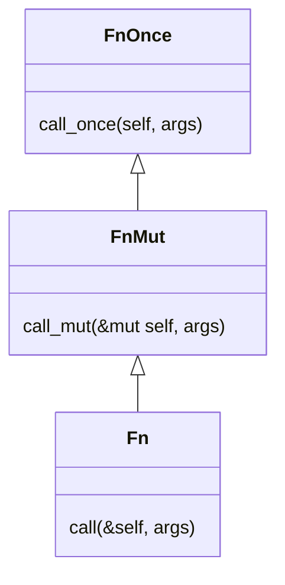

# Appendix B: Closures - Fn, FnMut, FnOnce Traits

This document covers Rust's closure traits and how they represent different levels of capture and mutation.

## What Are Closures?

Closures are **anonymous functions that can capture local variables from outside their body**. They look like lambda functions from other languages:

```rust
let y = 5;
let add_y = |x: i32| x + y;  // ✅ Closure: captures y (declared outside)
add_y(10)  // 15
```

### What Makes Something a Closure?

**Closures** (anonymous functions with captures):
```rust
let multiplier = 10;
let multiply = |x| x * multiplier;  // ✅ Captures multiplier

let mut count = 0;
let increment = || { count += 1; };  // ✅ Captures and mutates count

let data = vec![1, 2, 3];
let processor = move || println!("{:?}", data);  // ✅ Takes ownership of data
```

**Not closures** (regular functions):
```rust
fn add(x: i32, y: i32) -> i32 {
    x + y  // ✅ Regular function: no captures, globally defined
}

fn double(x: i32) -> i32 {
    x * 2  // ✅ Regular function: all data comes from parameters
}
```

**Not closures** (closures without captures):
```rust
let add_one = |x| x + 1;  // ⚠️ Technically a closure, but captures nothing
                           //    Behaves like a regular function (zero-size!)
```

### Key Differences from Regular Functions

Compare a closure to a regular function:

```rust
let y = 5;

// ✅ Closure: can access y from environment
let add_y = |x: i32| x + y;

// ❌ Function: cannot access y
fn add_y_fn(x: i32) -> i32 {
    x + y  // ERROR: Can't access y, not in function scope
}
```

**Regular functions** are:
- Globally defined with `fn` keyword
- Stateless (no captured environment)
- Can only access their parameters and global items

**Closures** are:
- Locally defined with `||` syntax
- Can capture variables from their surrounding scope
- Each closure has a unique, compiler-generated type

### Closures Can Have State

Because closures capture variables, they can **maintain state** across multiple calls:

```rust
let mut count = 0;

let mut counter = || {
    count += 1;
    count
};

println!("{}", counter());  // 1
println!("{}", counter());  // 2
println!("{}", counter());  // 3

// count is now 3 (modified by the closure)
println!("{}", count);  // 3
```

This is powerful! The closure `counter` "remembers" the value of `count` between calls. Each time you call it, it increments and returns the new value.

**Regular functions cannot do this:**

```rust
fn counter_fn() -> i32 {
    let mut count = 0;  // Reset to 0 every time!
    count += 1;
    count
}

println!("{}", counter_fn());  // 1
println!("{}", counter_fn());  // 1 (doesn't remember previous calls)
println!("{}", counter_fn());  // 1
```

This stateful behavior makes closures useful for:
- Event handlers that track state
- Iterators that maintain position
- Callbacks that accumulate results
- Any situation where you need a function with memory

## The Three Closure Traits

Rust represents closures as traits. Every closure implements one (or more) of these three traits.

**The compiler automatically decides which trait(s) a closure implements** based on how it uses captured variables:

```rust
let s = String::from("hello");

// Closure that only borrows:
let closure1 = || {
    println!("{}", s);  // Only borrows s (immutable reference)
};
// ✅ closure1 implements Fn (and FnMut, and FnOnce)

// Closure that mutates:
let mut count = 0;
let mut closure2 = || {
    count += 1;  // Mutates count (mutable reference)
};
// ✅ closure2 implements FnMut (and FnOnce, but NOT Fn)

// Closure that consumes:
let closure3 = || {
    let s1 = s;  // Moves s (takes ownership)
};
// ✅ closure3 implements FnOnce only (NOT Fn or FnMut)
```

You don't specify which trait - the compiler infers it from the closure body.

### FnOnce - Call Once, Consumes Captures

```rust
pub trait FnOnce<Args> {
    type Output;
    fn call_once(self, args: Args) -> Self::Output;
}
```

**Key: `self` (takes ownership of the closure)**

The closure consumes itself when called - can only be called once. Used when the closure **takes ownership** of captured values:

```rust
let s = String::from("hello");

let once = || {
    let s1 = s; // Takes ownership - s is gone after this
};

once();
once();  // ❌ ERROR: once already consumed
```

### FnMut - Call Multiple Times, Mutable Capture

```rust
pub trait FnMut<Args>: FnOnce<Args> {
    fn call_mut(&mut self, args: Args) -> Self::Output;
}
```

**Key: `&mut self` (can modify the closure's captures)**

The closure can be called multiple times and can **mutate** captured values:

```rust
let mut counter = 0;

let mut increment = || {
    counter += 1;  // Mutates counter (captured by mut ref)
    counter
};

increment();  // 1
increment();  // 2
increment();  // 3
```

### Fn - Call Multiple Times, Immutable Capture

```rust
pub trait Fn<Args>: FnMut<Args> {
    fn call(&self, args: Args) -> Self::Output;
}
```

**Key: `&self` (only reads captures, never modifies)**

The closure can be called any number of times without modifying anything:

```rust
let multiplier = 5;

let multiply = |x: i32| x * multiplier;  // Only reads multiplier

multiply(2);   // 10
multiply(3);   // 15
multiply(4);   // 20
```

### Trait Hierarchy

`Fn` is the most restrictive, `FnOnce` is the most general:

<div align="center">



</div>

This means:
- A function that accepts `FnOnce` can take any closure (Fn, FnMut, or FnOnce)
- A function that accepts `FnMut` can take Fn or FnMut, but NOT FnOnce-only closures
- A function that accepts `Fn` can only take Fn closures

### When to Use Each Trait

**Decision tree:**

1. **Does the closure take ownership of a captured value?** → `FnOnce`
2. **Does the closure mutate a captured value?** → `FnMut`
3. **Does the closure only read captured values?** → `Fn`

| Trait | Used When | Standard Library Examples |
| --- | --- | --- |
| `FnOnce` | Closure is called at most once | `Option::unwrap_or_else`, `Result::unwrap_or_else` |
| `FnMut` | Closure mutates captured state | `Iterator::for_each`, `[T]::sort_by` |
| `Fn` | Closure is pure (no side effects) | `Iterator::map`, `Iterator::filter` |

## How Closures Work: Generated Structs

Under the hood, every closure is an anonymous struct that the compiler generates for you. This struct contains fields for each captured variable, and implements one of the three closure traits (`Fn`, `FnMut`, or `FnOnce`). Understanding this desugaring helps explain why closures behave the way they do.

**Key insights:**

- Each closure gets a unique, compiler-generated anonymous struct type
- The struct contains fields for each captured variable
- Which trait is implemented depends on how the captured variables are used
- `call_once` takes `self` (consumes the closure), `call_mut` takes `&mut self` (mutates captures), `call` takes `&self` (immutable access)
- This is why you can't write the closure's type explicitly - it's anonymous and compiler-generated
- Closures are a **zero-cost abstraction**: the generated struct is exactly the size of the captured data, with no runtime indirection
- The `extern "rust-call"` ABI efficiently unpacks argument tuples with zero runtime cost

### Example 1: FnOnce Closure (Captures by Value)

When a closure **consumes** a captured variable (moves it), it implements `FnOnce`:

```rust
// What you write:
let s = String::from("hello");

let consume = |prefix: &str| {
    let s1 = s;  // Moves s into s1 (takes ownership)
    println!("{}: {}", prefix, s1);
};
consume("Processing");
// consume("Again");  // ❌ ERROR: consume already called
```

Here's roughly what Rust generates:

```rust
// Compiler-generated anonymous struct:
struct ClosureEnv {
    s: String,  // Captured by value (takes ownership)
}

// Compiler-generated trait impl:
impl FnOnce<(&str,)> for ClosureEnv {
    type Output = ();

    extern "rust-call" fn call_once(self, args: (&str,)) -> Self::Output {
        // The closure body:
        let s1 = self.s;  // Moves self.s into s1
        println!("{}: {}", args.0, s1);
    }
}
```

Notice that `call_once` takes `self` (not `&self` or `&mut self`). This means the closure consumes itself - it can only be called once. When we call `consume("Processing")`, the entire struct is moved into the `call_once` method along with the argument tuple `("Processing",)`, the closure body executes, and the struct is dropped.

**Important:** The closure implements `FnOnce` because it **consumes** `s` by moving it into the local variable `s1`. If the closure only borrowed `s` (like `println!("{}", s)` without the move), it would implement `Fn` instead.

> **Type vs Trait:** If you hover over `consume` in your IDE, it will show the type as `impl FnOnce(&str)`. This doesn't mean the type *is* `FnOnce` - rather, it's an anonymous struct (like `ClosureEnv` above) that **implements** the `FnOnce(&str)` trait. The IDE shows `impl FnOnce(&str)` because the actual struct name is compiler-generated and unknowable.

### Example 2: FnMut Closure (Captures by Mutable Reference)

When a closure **mutates** a captured variable, it implements `FnMut`:

```rust
let mut count = 0;
let mut increment = |delta: i32| {
    count += delta;  // Mutates count
};
increment(1);
increment(2);
println!("{}", count);  // 3
```

Here's roughly what Rust generates:

```rust
// Compiler-generated anonymous struct:
struct ClosureEnv<'a> {
    count: &'a mut i32,  // Captured by mutable reference
}

// Compiler-generated trait impl:
impl<'a> FnMut<(i32,)> for ClosureEnv<'a> {
    extern "rust-call" fn call_mut(&mut self, args: (i32,)) -> Self::Output {
        // The closure body:
        *self.count += args.0;
    }
}

// FnMut also requires FnOnce:
impl<'a> FnOnce<(i32,)> for ClosureEnv<'a> {
    type Output = ();

    extern "rust-call" fn call_once(mut self, args: (i32,)) -> Self::Output {
        self.call_mut(args);
    }
}
```

Notice that `call_mut` takes `&mut self`. This allows the closure to mutate its captures (via the mutable reference), but the closure itself isn't consumed - it can be called multiple times. The struct stores a mutable reference to `count`, not the value itself.

### Example 3: Fn Closure (Captures by Immutable Reference)

When a closure only **reads** captured variables, it implements `Fn`:

```rust
// What you write:
let y = 5;
let add_y = |x: i32| x + y;
let result1 = add_y(10);  // 15
let result2 = add_y(20);  // 25
```

Here's roughly what Rust generates:

```rust
// Compiler-generated anonymous struct:
struct ClosureEnv<'a> {
    y: &'a i32,  // Captured by immutable reference
}

// Compiler-generated trait impl:
impl<'a> Fn<(i32,)> for ClosureEnv<'a> {
    extern "rust-call" fn call(&self, args: (i32,)) -> Self::Output {
        // The closure body:
        args.0 + *self.y
    }
}

// Fn also requires FnMut and FnOnce:
impl<'a> FnMut<(i32,)> for ClosureEnv<'a> {
    extern "rust-call" fn call_mut(&mut self, args: (i32,)) -> Self::Output {
        self.call(args)
    }
}

impl<'a> FnOnce<(i32,)> for ClosureEnv<'a> {
    type Output = i32;

    extern "rust-call" fn call_once(self, args: (i32,)) -> Self::Output {
        self.call(args)
    }
}
```

Notice that `call` takes `&self` (immutable reference). The closure can be called many times because it doesn't modify anything. The struct stores an immutable reference to `y`, allowing the closure to read it repeatedly.

### Closures with No Captures

If a closure doesn't capture any variables, the generated struct is empty:

```rust
// What you write:
let always_five = || 5;
println!("{}", std::mem::size_of_val(&always_five));  // 0 bytes!

// What Rust generates:
struct ClosureEnv;  // Empty struct

impl Fn<()> for ClosureEnv {
    extern "rust-call" fn call(&self, args: ()) -> i32 {
        5
    }
}
```

An empty struct has zero size! This is why closures that capture nothing compile down to pure function calls - they're literally free abstractions.

## The `move` Keyword: Forcing Ownership

By default, closures capture variables **by reference** (either `&T` or `&mut T`). The `move` keyword forces the closure to **take ownership** of all captured variables.

### Syntax

```rust
let s = String::from("hello");
let closure = move || {
    println!("{}", s);  // Takes ownership of s
};
```

### What `move` Does

**Without `move`** (default), closures capture by reference:

```rust
let s = String::from("hello");
let closure = || println!("{}", s);  // Borrows s as &String
closure();
println!("{}", s);  // ✅ OK: s is still available
```

**Without `move`**, you can also force the closure to consume a captured variable by moving it inside the closure body:

```rust
let s = String::from("hello");
let closure = || {
    let s1 = s;  // Moves s out of the environment (forces ownership)
    println!("{}", s1);
};
closure();
// closure();  // ❌ ERROR: closure is FnOnce, can't call twice
// println!("{}", s);  // ❌ ERROR: s was moved into closure
```

This makes the closure `FnOnce` because it consumes `s` on the first call - **the closure cannot be called multiple times**.

Here's what Rust generates:

```rust
// Compiler-generated struct:
struct ClosureEnv<'a> {
    s: &'a String,  // Captured by reference (not owned!)
}

// Implements FnOnce only:
impl<'a> FnOnce<()> for ClosureEnv<'a> {
    type Output = ();

    extern "rust-call" fn call_once(self, args: ()) -> Self::Output {
        let s1 = *self.s;  // Moves the String out through the reference
        println!("{}", s1);
    }
}
```

Notice: The struct captures `s` by **reference** (`&'a String`), but the closure body moves the value out, making it `FnOnce`.

#### How the closure is instantiated

When you write the closure, Rust automatically creates an instance of the generated struct and captures the environment:

```rust
// What you write:
let s = String::from("hello");
let closure = || {
    let s1 = s;
    println!("{}", s1);
};

// What Rust generates (conceptual):
let s = String::from("hello");
let closure = ClosureEnv {
    s: &s,  // Captures s by reference
};

// When you call the closure:
closure();
// Rust generates:
FnOnce::call_once(closure, ());  // Moves closure, calls call_once
```

The key steps:
1. **Closure creation**: `ClosureEnv { s: &s }` - the struct is instantiated with a reference to `s`
2. **Closure call**: `FnOnce::call_once(closure, ())` - the entire struct is moved into `call_once`
3. **Inside call_once**: `let s1 = *self.s` - the String is moved out through the reference
4. **After call**: The closure is consumed and cannot be called again

**With `move`**, closures take ownership at closure creation time, but can still be called multiple times:

```rust
let s = String::from("hello");
let closure = move || println!("{}", s);  // Takes ownership of s immediately
closure();
closure();  // ✅ OK: closure is Fn, can call multiple times!
// println!("{}", s);  // ❌ ERROR: s was moved at closure creation (line 2)
```

The closure is still `Fn` (not `FnOnce`) because it only **reads** `s`, it doesn't consume it. The `move` keyword affects **when** ownership is transferred (at creation vs at call time), not whether the closure can be called multiple times.

Here's what Rust generates:

```rust
// Compiler-generated struct:
struct ClosureEnv {
    s: String,  // Owned by the closure (moved at creation)
}

// Implements Fn (and FnMut, and FnOnce):
impl Fn<()> for ClosureEnv {
    extern "rust-call" fn call(&self, args: ()) -> Self::Output {
        println!("{}", self.s);  // Only reads self.s, doesn't consume it
    }
}
impl FnMut<()> for ClosureEnv {...}
impl FnOnce<()> for ClosureEnv {...}
```

Notice: The struct **owns** `s` (`String`, not `&String`), and the closure implements `Fn` because `call` only **reads** `self.s` without consuming it. The closure can be called multiple times.

**Key difference:**
- **Without `move`**: Variable is captured by reference; ownership transfer happens **when the closure runs** (if moved in body)
- **With `move`**: Variable ownership is transferred **when the closure is created**

### When to Use `move`

#### Use Case 1: Returning Closures

Closures that capture references can't outlive those references. Use `move` to transfer ownership:

```rust
fn make_greeter(name: String) -> impl Fn() {
    move || println!("Hello, {}!", name)  // Takes ownership of name
}

let greet = make_greeter(String::from("Alice"));
greet();  // "Hello, Alice!"
```

Without `move`, this would fail:

```rust
fn make_greeter(name: String) -> impl Fn() {
    || println!("Hello, {}!", name)  // ❌ ERROR: borrowed value doesn't live long enough
}
```

#### Use Case 2: Spawning Threads

Threads require `'static` lifetime. Use `move` to transfer ownership to the thread:

```rust
use std::thread;

let data = vec![1, 2, 3];

thread::spawn(move || {
    println!("{:?}", data);  // Takes ownership of data
}).join().unwrap();

println!("{:?}", data);  // ❌ ERROR: data was moved
```

Without `move`:

```rust
let data = vec![1, 2, 3];

thread::spawn(|| {
    println!("{:?}", data);  // ❌ ERROR: closure may outlive current function
}).join().unwrap();
```

#### Use Case 3: Async Functions

Similar to threads, async closures often need `move` to avoid lifetime issues:

```rust
async fn process_data(data: Vec<i32>) {
    tokio::spawn(move || async move {
        // Process data asynchronously
        println!("{:?}", data);
    });
}
```

### `move` with Copy Types

For types that implement `Copy` (like `i32`, `bool`, `char`), `move` copies the value instead of moving it:

```rust
let x = 42;
let closure = move || println!("{}", x);  // Copies x (i32 is Copy)
closure();
println!("{}", x);  // ✅ OK: x is still available (was copied, not moved)
```

### `move` with Non-Copy Types

For non-Copy types (like `String`, `Vec`), `move` transfers ownership:

```rust
let s = String::from("hello");
let closure = move || println!("{}", s);  // Moves s (String is not Copy)
closure();
println!("{}", s);  // ❌ ERROR: s was moved
```

### Selective Moving

You can't selectively choose which variables to move - `move` applies to **all** captured variables:

```rust
let x = String::from("x");
let y = String::from("y");

let closure = move || {
    println!("{}", x);  // Both x and y are moved
    // Even if we don't use y, it's still moved
};

// println!("{}", x);  // ❌ ERROR: moved
// println!("{}", y);  // ❌ ERROR: moved (even though not used in closure)
```

If you need selective ownership, clone the values you want to keep:

```rust
let x = String::from("x");
let y = String::from("y");
let y_clone = y.clone();

let closure = move || {
    println!("{}", x);  // x is moved
    println!("{}", y_clone);  // y_clone is moved
};

println!("{}", y);  // ✅ OK: original y is still available
```

### Common Pattern: Clone Before `move`

A common pattern is to clone before using `move`:

```rust
use std::sync::Arc;

let data = Arc::new(vec![1, 2, 3]);
let data_clone = Arc::clone(&data);

std::thread::spawn(move || {
    println!("{:?}", data_clone);  // Uses clone, not original
}).join().unwrap();

println!("{:?}", data);  // ✅ OK: original Arc still available
```

### Key Takeaways

- **`move` forces ownership transfer** of all captured variables
- **Use `move` when**:
  - Returning closures from functions
  - Spawning threads or async tasks
  - The closure needs to outlive the current scope
- **Copy types** (like `i32`) are copied, not moved
- **Non-Copy types** (like `String`) are moved and become unavailable
- **`move` applies to all captures** - you can't selectively move some variables
- **Clone before `move`** if you need to keep the original value

## Closure Size and Zero-Cost Abstractions

Each closure has a **compiler-generated anonymous type** with fields for each captured variable. The size of a closure equals the size of its captured data:

```rust
let x = 5i32;           // 4 bytes
let y = 10i32;          // 4 bytes
let z = String::from("hello");  // 24 bytes (on modern Rust)

let closure = || {
    let _ = x;    // Captures x: 4 bytes
    let _ = y;    // Captures y: 4 bytes
    let _ = z;    // Captures z: 24 bytes
};

println!("{}", std::mem::size_of_val(&closure));  // 32 bytes
```

**Important:** The `String` is 24 bytes of **stack metadata** (pointer + length + capacity), not the heap data itself. The actual string bytes `"hello"` live on the heap and aren't counted in the closure's size. `size_of_val` only measures the stack footprint of the closure struct.

### Zero Size Closures

Closures that capture nothing have zero size:

```rust
let zero_size = || 42;
println!("{}", std::mem::size_of_val(&zero_size));  // 0 bytes!
```

### Why Zero-Cost?

This is why Rust closures are **zero-cost abstractions** - they compile down to the same code as manual structs, with no runtime overhead:

- No indirection (direct field access)
- No heap allocation (stack-allocated struct)
- No wrapper overhead (just the captured data)
- Argument passing via `extern "rust-call"` ABI compiles to efficient assembly

The compiler generates optimal code that's equivalent to hand-written structs with method calls.

## Common Misconceptions: Closure Types

### Misconception: "`Fn(i32) -> i32` is the closure's type"

When you hover over a closure in your IDE, you might see something like `impl Fn(i32) -> i32`:

```rust
let f = |x: i32| x + 2;
// IDE shows: impl Fn(i32) -> i32
```

**This is NOT the closure's actual type.** Here's the truth:

1. **`Fn` is a trait, not a type.** Just like `Iterator` or `Debug`, it's something types can implement.
2. **The closure has a unique, anonymous compiler-generated type** (as we discussed in the "How Closures Work" section).
3. **The IDE notation `impl Fn(i32) -> i32` means**: "some unknown type that implements the `Fn(i32) -> i32` trait"

### What is the actual type?

Every closure has a **unique, unnamed type** that only the compiler knows:

```rust
let f = |x: i32| x + 2;
let g = |x: i32| x + 2;  // Same code, but different type!

// ❌ ERROR: mismatched types
// let h: typeof(f) = g;  // Can't do this - f and g have different types
```

Even though `f` and `g` have identical code, they're **different types** with different anonymous names generated by the compiler. This is why you can't write the type explicitly - it doesn't have a name you can refer to.

### How to annotate closure types

Since you can't name the exact type, you have three options:

#### Option 1: Let the compiler infer (recommended)

```rust
let f = |x: i32| x + 2;  // Type is inferred
```

This is the most common approach. The compiler figures out the type automatically.

#### Option 2: Use a trait bound with generics

When passing closures as parameters, use generic type parameters with trait bounds:

```rust
fn apply<F>(f: F, x: i32) -> i32
where
    F: Fn(i32) -> i32,  // F is any type that implements Fn(i32) -> i32
{
    f(x)
}

let f = |x: i32| x + 2;
apply(f, 5);  // 7
```

This is **static dispatch** - the compiler generates specialized code for each closure type, with zero runtime cost.

#### Option 3: Use `impl Trait` (modern Rust)

For function parameters and return types, you can use `impl Trait`:

```rust
fn make_adder(n: i32) -> impl Fn(i32) -> i32 {
    move |x| x + n
}

fn apply(f: impl Fn(i32) -> i32, x: i32) -> i32 {
    f(x)
}
```

This is syntactic sugar for generic type parameters with trait bounds. Still static dispatch, zero cost.

#### Option 4: Use trait objects (`Box<dyn Fn>`)

If you need to store closures with different types in the same collection, use **trait objects**:

```rust
let closures: Vec<Box<dyn Fn(i32) -> i32>> = vec![
    Box::new(|x| x + 1),
    Box::new(|x| x * 2),
    Box::new(|x| x - 3),
];

for f in &closures {
    println!("{}", f(10));  // 11, 20, 7
}
```

This is **dynamic dispatch** - has a small runtime cost (heap allocation + vtable lookup) but allows heterogeneous collections.

### Type annotation examples

```rust
// ❌ ERROR: Can't use Fn as a concrete type
let f: Fn(i32) -> i32 = |x| x + 2;

// ✅ OK: Let compiler infer
let f = |x: i32| x + 2;

// ✅ OK: Use impl Trait in function parameter
fn apply(f: impl Fn(i32) -> i32, x: i32) -> i32 {
    f(x)
}

// ✅ OK: Use generic with trait bound
fn apply_generic<F: Fn(i32) -> i32>(f: F, x: i32) -> i32 {
    f(x)
}

// ✅ OK: Use trait object (dynamic dispatch)
let f: Box<dyn Fn(i32) -> i32> = Box::new(|x| x + 2);

// ✅ OK: Reference to trait object
let f = |x: i32| x + 2;
let f_ref: &dyn Fn(i32) -> i32 = &f;
```

### Key Takeaways

- **`Fn(T) -> U` is a trait**, not a type
- **Every closure has a unique anonymous type** generated by the compiler
- **You cannot write the closure's actual type** - it's unnamed
- **Use trait bounds or trait objects** when you need to annotate types
- **Prefer static dispatch** (`impl Trait` or generics) for zero-cost abstractions
- **Use dynamic dispatch** (`Box<dyn Fn>`) only when you need type flexibility at runtime

---

See also: [Appendix Index](appendix.md) | [A: Send and Sync](appendix-send-sync.md) | [C: Dynamic Dispatch](appendix-dynamic-dispatch.md)
