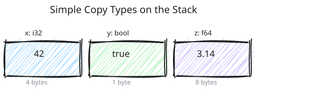
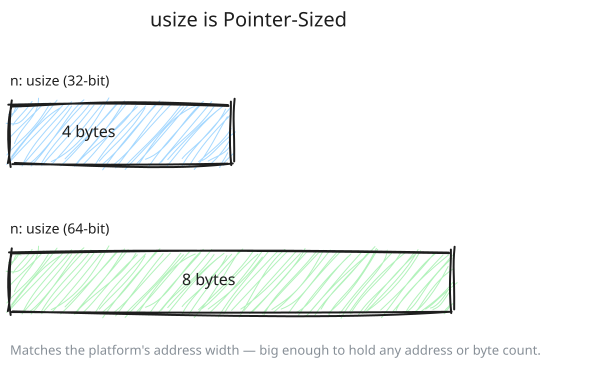
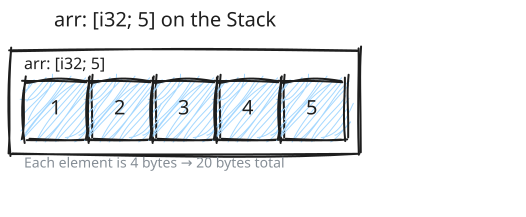
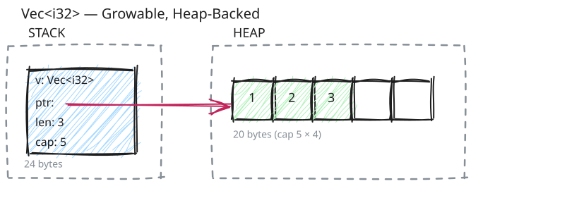
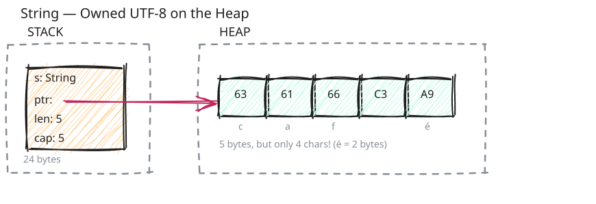
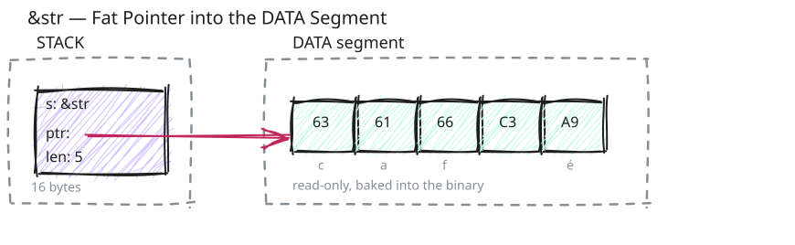
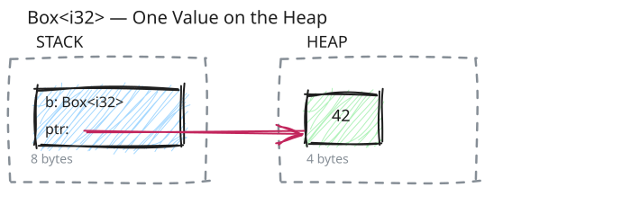
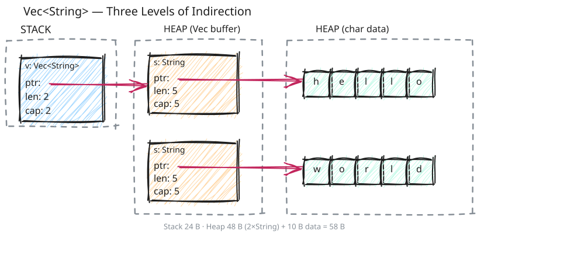

# Visualizing Types

Let's see where different types memory layout:

### Simple Types (Copy)

```rust
let x: i32 = 42;
let y: bool = true;
let z: f64 = 3.14;
```



### `usize`

```rust
let n: usize = 42;
```



`usize` is the pointer-sized unsigned integer: 8 bytes on 64-bit, 4 bytes on
32-bit. It matches the platform's address space — `usize` can hold any memory
address or byte count the machine can address.

You'll see `usize` everywhere we talk about memory:

- **Pointers** are `usize`-sized — they need to address any byte in memory.
- **Lengths and capacities** of collections (`Vec`, `String`, slices) are
  `usize`. They count bytes in memory, so they're bounded by the address
  space. If `len` were `u32`, a `Vec` couldn't hold more than ~4 GB even on a
  machine with terabytes of RAM. If it were `u64`, you'd waste 4 bytes on
  every `Vec` on 32-bit platforms.
- **Indexing** uses `usize`. `v[i]` expects `i: usize`, so lengths line up
  without casts.

| Platform | `usize` |
| -------- | ------- |
| 64-bit   | 8 bytes |
| 32-bit   | 4 bytes |

The rest of this chapter assumes 64-bit, where `usize` = 8 bytes.

### Arrays (Fixed Size)

```rust
let arr: [i32; 5] = [1, 2, 3, 4, 5];
```



### Vec

```rust
let v = vec![1, 2, 3];
```



`ptr`, `len`, and `cap` are each a `usize` — 3 × 8 = **24 bytes** on the stack
on a 64-bit system (12 bytes on 32-bit).

### String

Remember, a `String` is basically a `Vec` of `u8`.

```rust
let s = String::from("café");
```



`String` stores UTF-8 encoded bytes, not characters. The `é` character needs
2 bytes (`0xC3 0xA9`), so `s.len() == 5` (bytes) while `s.chars().count() == 4`
(characters).

### String Literal (`&str`)

```rust
let s = "café";
```



A `&str` is a **fat pointer**: just a pointer and a length, no capacity. It's a
read-only view into bytes that already exist somewhere — in this case, the DATA
segment baked into the binary at compile time.

|                 | `String`                   | `&str`               |
| --------------- | -------------------------- | -------------------- |
| Stack size      | 24 bytes (ptr + len + cap) | 16 bytes (ptr + len) |
| Heap allocation | Yes                        | No                   |
| Growable        | Yes (`push_str`, `push`)   | No (read-only)       |
| Owns data       | Yes                        | No (borrows)         |

### Box

```rust
let b = Box::new(42);
```



### Nested Types

```rust
let v: Vec<String> = vec![
    String::from("hello"),
    String::from("world"),
];
```



- Stack: 24 bytes (Vec metadata)
- Heap: 48 bytes (2 × String metadata: 2 × 24 bytes) + 10 bytes (string data)
- Total heap: 58 bytes

**Three levels of indirection!**

1. `v` points to array of `String`s
2. Each `String` points to its character data
3. All on the heap

Compare this with an array of string literals:

```rust
let arr: [&str; 2] = ["hello", "world"];
```

![An [&str; 2] array holds two 16-byte fat pointers on the stack (32 bytes), both pointing into the DATA segment - zero heap](images/memory-layout-arr-str.svg)

- Stack: 32 bytes (2 × `&str`, each is a fat pointer: 8-byte ptr + 8-byte len)
- Heap: **0 bytes!** String literals live in the DATA segment, baked into the
  binary at compile time
- No `cap` field — `&str` is a read-only view, it can't grow

This is why `&str` is so cheap compared to `String`: no heap allocation, no
capacity tracking, just a pointer and a length.

## Common Misconceptions

### Misconception #1: "Box makes things bigger"

```rust
let x = 42;           // 4 bytes
let b = Box::new(42); // How many bytes?
```

**Answer:** `b` is 8 bytes (just a pointer), but total memory usage is 12 bytes (8 + 4).

**However:** Boxing can actually **save stack space** for large types:

```rust
let huge = [0u8; 1_000_000];        // 1 MB on stack! Dangerous!
let boxed = Box::new([0u8; 1_000_000]); // 8 bytes on stack, 1 MB on heap
```

### Misconception #2: "All heap allocations are slow"

Not all heap operations allocate:

```rust
let mut v = Vec::with_capacity(100);  // ✅ One allocation

for i in 0..50 {
    v.push(i);  // ✅ No allocation - within capacity
}

v.push(51);  // ✅ Still no allocation
v.push(52);  // ✅ Still no allocation
// ... up to 100 elements, still no allocation

v.push(101);  // ❌ NOW we reallocate (capacity exceeded)
```

Pre-allocating capacity is a common optimization!

## Performance Implications

### Stack Operations (Fast)

```rust
fn stack_test() {
    let x = 42;        // ~1 CPU cycle (write to pre-allocated stack slot)
    let y = x;         // ~1 CPU cycle (copy 4 bytes)
}
```

**Cost:** ~3 CPU cycles

### Heap Operations (Slow)

```rust
fn heap_test() {
    let x = Box::new(42);  // ~100 CPU cycles (call allocator)
    let y = x;             // ~1 CPU cycle (copy 8-byte pointer)
}  // ~100 CPU cycles (call deallocator)
```

**Cost:** ~200 CPU cycles

**100x slower!** But remember:

- This is microseconds, not seconds
- Sometimes you need the heap (dynamic size, large data, shared ownership)
- The real cost is in **many allocations**, not just one

### Optimization Tips

1. **Pre-allocate collections:**

```rust
// Bad: multiple allocations
let mut v = Vec::new();
for i in 0..1000 { v.push(i); }

// Good: one allocation
let mut v = Vec::with_capacity(1000);
for i in 0..1000 { v.push(i); }
```

2. **Use `&str` instead of `String` when possible:**

```rust
// Bad: allocates on heap
fn greet(name: String) {
    println!("Hello, {}", name);
}

// Good: no allocation
fn greet(name: &str) {
    println!("Hello, {}", name);
}
```

3. **Use `[T; N]` instead of `Vec<T>` for fixed-size data:**

```rust
// Bad: heap allocation
let v = vec![0; 10];

// Good: stack allocation
let arr = [0; 10];
```

4. **Avoid cloning when borrowing works:**

```rust
// Bad: clones the string (heap allocation)
fn process(s: String) {
    println!("{}", s);
}
let s = String::from("hello");
process(s.clone());

// Good: borrows (no allocation)
fn process(s: &str) {
    println!("{}", s);
}
process(&s);
```

## Key Takeaways

1. **Stack is automatic** - variables disappear when out of scope
2. **Heap is manual** - you allocate/deallocate (Rust automates via `Drop`)
3. **Stack is fast** - just move a pointer
4. **Heap is flexible** - dynamic size, outlives scope
5. **String/Vec/Box are smart pointers** - metadata on stack, data on heap
6. **Static data lives forever** - loaded at program start
7. **Use stack by default** - only heap allocate when necessary
8. **Pre-allocate when possible** - avoid repeated reallocations

## Further Reading

- [cheats.rs/#memory-layout](https://cheats.rs/#memory-layout) - Visual memory layouts for Rust types
- **The Rustonomicon**: Memory layout and representation
- **Rust Performance Book**: Memory allocation strategies
- **Operating Systems textbooks**: Virtual memory, process address space

---
