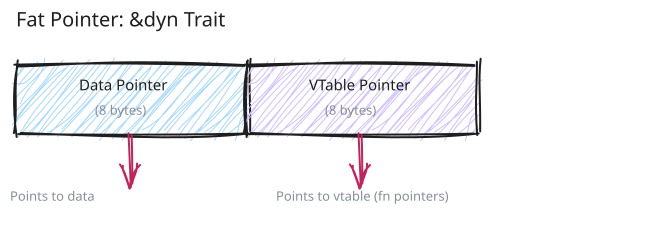
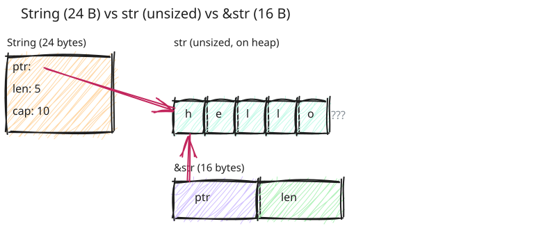

# Appendix: Sized - Understanding Compile-Time Size

This document covers Rust's `Sized` trait and dynamically-sized types (DSTs) - one of Rust's most invisible yet fundamental features.

## The Invisible Trait You Use Everywhere

Have you ever seen a trait called `Sized`? Probably not - you've never written `impl Sized` or added a `Sized` bound to anything.

Yet `Sized` is the most commonly used trait in Rust. It's on almost every generic type parameter you write, silently added by the compiler:

```rust
// What you write:
fn process<T>(value: T) { }

// What the compiler sees:
fn process<T: Sized>(value: T) { }
//            ^^^^^^ Invisible implicit bound!
```

That `Sized` bound is **automatically added** to every generic type parameter unless you explicitly opt out. It's so common that Rust makes it implicit to reduce noise.

## What is "Size"?

When we say a type has a "size," we mean we can figure out its memory layout just by looking at the type.

Take these three:

```rust
let x: i32 = ???;
let s: String = ???;
let arr: [u8; 10] = ???;
```

After reading [the previous chapter](appendix-memory-layout-3-types.md), we can draw their layouts just from the types alone — we don't even need to know the values:

![Sized types have layouts known from the type alone: i32 is 4 bytes, String is a 24-byte {ptr,len,cap} struct, [u8;10] is 10 bytes](images/memory-layout-sized-known.svg)

We know `i32` is always 4 bytes. We know `String` is always 24 bytes — three `usize` fields for pointer, length, and capacity. We know `[u8; 10]` is always 10 bytes — the length is baked into the type. These types are `Sized`.

And if _we_ can figure it out, so can the compiler.

## The Sized Trait

```rust
pub trait Sized {
    // This trait has no methods - it's a marker trait
}
```

`Sized` is a **marker trait** - it has no methods, it just marks types that have a known size at compile time.

### Automatic Implementation

Unlike most traits, you never implement `Sized` manually. The compiler automatically implements it for types it can determine the size of:

```rust
// Compiler automatically implements Sized for these:
impl Sized for i32 { }
impl Sized for String { }
impl Sized for [u8; 10] { }
impl<T> Sized for Vec<T> { }
impl<T> Sized for Box<T> { }  // Box itself is sized (it's just a pointer)
```

### The Implicit Bound

Here's where things get interesting. **Every generic type parameter has an implicit `Sized` bound:**

```rust
// What you write:
fn process<T>(value: T) { }

// What the compiler actually sees:
fn process<T: Sized>(value: T) { }
```

This happens because:

1. The function takes `value: T` by value (copies it onto the stack)
2. To copy it, the compiler needs to know its size
3. So `T` must be `Sized`

Same with struct fields:

```rust
// What you write:
struct Container<T> {
    value: T,
}

// What the compiler sees:
struct Container<T: Sized> {
    value: T,
}
```

The struct needs to know how big `T` is to calculate its own size!

## Dynamically Sized Types (DSTs)

Now we get to the interesting part: types that DON'T have a known size at compile time.

Consider this:

```rust
let slice: [i32] = ???;
```

Looks like an array, right? Try to draw its layout:

![[i32] is unsized: the type says nothing about how many elements there are, so total byte size is unknown at compile time](images/memory-layout-unsized-slice.svg)

Unlike `[i32; 3]`, the type `[i32]` doesn't include the length — without it, we can't pin down the layout or the total size from the type alone.

If this confuses us, it confuses the compiler too. The code above is a compilation error.

These are called **Dynamically Sized Types** (DSTs), and there are exactly three kinds in Rust:

### 1. Slices (`[T]`)

A slice is **just the items, without any metadata**:

```rust
// This doesn't compile:
// let slice: [i32] = ???;  // ❌ How big is this? 1 element? 10? 1000?

// Slices must always be behind a pointer:
let slice: &[i32] = &[1, 2, 3];     // ✅ Reference to slice
let boxed: Box<[i32]> = Box::new([1, 2, 3]);  // ✅ Box containing slice
```

Why is `[i32]` unsized but `[i32; 3]` is sized?

- `[i32; 3]` = exactly 3 integers = 12 bytes (always!)
- `[i32]` = some number of integers = ??? bytes (depends on runtime data)

The **number of elements is part of the type** for arrays but not for slices!

### 2. String Slices (`str`)

Same as slices, but for strings:

```rust
// This doesn't compile:
// let s: str = "hello";  // ❌ How many bytes? Depends on the string!

// Must be behind a pointer:
let s: &str = "hello";              // ✅ Reference to str
let boxed: Box<str> = "hello".into();  // ✅ Box containing str
```

`String` is sized (24 bytes of metadata), but `str` is unsized (the actual text data).

### 3. Trait Objects (`dyn Trait`)

When you use `dyn Trait`, the actual type is unknown at compile time:

```rust
trait Animal {
    fn speak(&self);
}

struct Dog;
impl Animal for Dog {
    fn speak(&self) { println!("Woof!"); }
}

struct Cat;
impl Animal for Cat {
    fn speak(&self) { println!("Meow!"); }
}

// This doesn't compile:
// let animal: dyn Animal = Dog;  // ❌ Is it a Dog? Cat? How big?

// Must be behind a pointer:
let animal: &dyn Animal = &Dog;          // ✅ Reference to trait object
let boxed: Box<dyn Animal> = Box::new(Cat);  // ✅ Box containing trait object
```

The compiler doesn't know if `animal` is a `Dog` (size `X`) or `Cat` (size `Y`), so it can't determine the size of `dyn Animal`.

## Fat Pointers: How References to DSTs Work

Here's a crucial insight: **references to unsized types are twice as large as normal pointers!**

```rust
println!("{}", std::mem::size_of::<&i32>());        // 8 bytes (on 64-bit)
println!("{}", std::mem::size_of::<&[i32]>());      // 16 bytes! (pointer + length)
println!("{}", std::mem::size_of::<&str>());        // 16 bytes! (pointer + length)
println!("{}", std::mem::size_of::<&dyn Animal>()); // 16 bytes! (pointer + vtable)
```

A reference to a DST is called a **fat pointer** because it contains extra metadata:

### Fat Pointer Layout

**For slices (`&[T]`) and string slices (`&str`):**

![A fat pointer for &[T] and &str: a data pointer (8 bytes) plus a length (8 bytes); the pointer points to the actual data](images/memory-layout-fatptr-slice.svg)

Example:

```rust
let data = [1, 2, 3, 4, 5];
let slice: &[i32] = &data[1..4];  // [2, 3, 4]

// Fat pointer contains:
// - Pointer to data[1] (the start of the slice)
// - Length: 3 (number of elements)
```

**For trait objects (`&dyn Trait`):**



Example:

```rust
let dog = Dog;
let animal: &dyn Animal = &dog;

// Fat pointer contains:
// - Pointer to dog
// - Pointer to vtable for Dog's Animal impl
```

The vtable is a table of function pointers for the trait's methods. This is how Rust does **dynamic dispatch** - looking up which method to call at runtime.

## The `?Sized` Bound: Opting Out

Sometimes you want to write code that works with **both sized and unsized types**. That's where `?Sized` comes in:

```rust
// T must be Sized (implicit):
fn only_sized<T>(value: &T) { }

// T can be unsized:
fn sized_or_unsized<T: ?Sized>(value: &T) { }
//                     ^^^^^^^ Opt out of the Sized requirement
```

The `?Sized` syntax means: "T may or may not be Sized" - it's a question mark about whether the Sized bound applies.

### When You Need `?Sized`

You need `?Sized` when you're working with **references or pointers** to potentially unsized types:

```rust
// This works with both &i32 and &[i32]:
fn print_len<T: ?Sized>(value: &T) {
    println!("Size of &T: {}", std::mem::size_of_val(&value));
}

let x = 42;
print_len(&x);        // &i32 (thin pointer, 8 bytes)

let slice = [1, 2, 3];
print_len(&slice[..]);  // &[i32] (fat pointer, 16 bytes)
```

### When You DON'T Need `?Sized`

If your function takes `T` by value, moves it, or stores it in a struct, you almost certainly need `Sized`:

```rust
// Can't work with unsized types:
fn take_by_value<T>(value: T) { }  // Needs to know size to copy
//               ^^^^ Implicit Sized bound

// let slice: [i32] = [1, 2, 3];
// take_by_value(slice);  // ❌ ERROR: size cannot be known at compile time
```

## Common Confusion Points

### Confusion #1: "&[T] is Sized, but [T] is Not"

This trips up everyone at first:

```rust
println!("{}", std::mem::size_of::<[i32]>());   // ❌ ERROR: size cannot be known
println!("{}", std::mem::size_of::<&[i32]>());  // ✅ OK: 16 bytes (fat pointer)
```

**Why?**

- `[i32]` is the slice itself (unsized - could be any length)
- `&[i32]` is a **reference** to a slice (sized - always 16 bytes on 64-bit: pointer + length)

The reference has a known size even though the thing it points to doesn't!

![Confusion #1: [i32] is unsized data of unknown length, while &[i32] is a sized fat pointer referencing that data](images/memory-layout-conf-slice.svg)

### Confusion #2: "String is Sized, but str is Not"

```rust
println!("{}", std::mem::size_of::<String>());  // ✅ 24 bytes
println!("{}", std::mem::size_of::<str>());     // ❌ ERROR
println!("{}", std::mem::size_of::<&str>());    // ✅ 16 bytes
```

**Why?**

- `String` is a struct with three fields (ptr, len, cap) - always 24 bytes
- `str` is the actual text data - variable length
- `&str` is a fat pointer to text data - always 16 bytes



### Confusion #3: "Box\<T\> is Sized, but Box\<[T]\> Also Exists"

```rust
println!("{}", std::mem::size_of::<Box<i32>>());    // 8 bytes (thin pointer)
println!("{}", std::mem::size_of::<Box<[i32]>>()); // 16 bytes (fat pointer)
println!("{}", std::mem::size_of::<Box<dyn Trait>>()); // 16 bytes (fat pointer)
```

**Why?**

- `Box<T>` is just a pointer (8 bytes) when `T` is sized
- `Box<[T]>` is a fat pointer (16 bytes: ptr + length)
- `Box<dyn Trait>` is a fat pointer (16 bytes: ptr + vtable)

The `Box` itself is always sized - it's just a pointer! But the pointer can be thin or fat depending on what it points to.

## Why Box, Cell, and RefCell Use `?Sized`

This is why the stdlib splits implementations:

```rust
// Methods that need to move T - require Sized:
impl<T> Box<T> {
    fn new(value: T) -> Box<T> { }     // Takes ownership of T (needs size)
    fn into_inner(self) -> T { }       // Returns owned T (needs size)
}

// Methods that only need references - work with ?Sized:
impl<T: ?Sized> Box<T> {
    fn as_ref(&self) -> &T { }         // Just returns a reference
    fn as_mut(&mut self) -> &mut T { } // Just returns a reference
    fn from_raw(ptr: *mut T) -> Box<T> { }  // Just stores a pointer
}
```

Same pattern for `Cell` and `RefCell`:

```rust
// Methods that move T:
impl<T> Cell<T> {
    fn new(value: T) -> Cell<T> { }    // Takes ownership
    fn set(&self, value: T) { }        // Takes ownership
}

// Methods that only use references:
impl<T: ?Sized> Cell<T> {
    fn as_ptr(&self) -> *mut T { }     // Just returns a pointer
    fn get_mut(&mut self) -> &mut T { } // Just returns a reference
}
```

This lets you use `Cell<[i32]>` even though `[i32]` is unsized!

```rust
let slice: &mut [i32] = &mut [1, 2, 3];
let cell: &Cell<[i32]> = Cell::from_mut(slice);
let ptr = cell.as_ptr();  // ✅ Works! Returns *mut [i32]
```

## Practical Examples

### Example 1: Generic Functions with Slices

Without `?Sized`, this function only works with fixed-size arrays:

```rust
// Only works with &[T; N]:
fn process<T>(slice: &T) {
    println!("Size: {}", std::mem::size_of_val(slice));
}

process(&[1, 2, 3]);  // ✅ &[i32; 3]
// process(&[1, 2, 3][..]);  // ❌ &[i32] is unsized!
```

With `?Sized`, it works with both:

```rust
// Works with both &[T; N] and &[T]:
fn process<T: ?Sized>(slice: &T) {
    println!("Size: {}", std::mem::size_of_val(slice));
}

process(&[1, 2, 3]);        // ✅ &[i32; 3]
process(&[1, 2, 3][..]);    // ✅ &[i32]
```

### Example 2: Trait Objects

```rust
trait Animal {
    fn speak(&self);
}

// Without ?Sized - only works with concrete types:
fn make_speak<T>(animal: &T) where T: Animal {
    animal.speak();
}

let dog = Dog;
make_speak(&dog);  // ✅ Works with &Dog

let animal: &dyn Animal = &dog;
// make_speak(animal);  // ❌ ERROR: dyn Animal is unsized!

// With ?Sized - works with trait objects too:
fn make_speak_dyn<T: ?Sized>(animal: &T) where T: Animal {
    animal.speak();
}

make_speak_dyn(&dog);     // ✅ Works with &Dog
make_speak_dyn(animal);   // ✅ Works with &dyn Animal
```

### Example 3: Smart Pointers

Why can you do `Box<dyn Trait>`? Because `Box` uses `?Sized`:

```rust
// This works:
let boxed: Box<dyn Animal> = Box::new(Dog);

// Because Box has:
impl<T: ?Sized> Box<T> {
    // Methods that work with unsized types
}
```

Without `?Sized`, you couldn't have `Box<[i32]>`, `Box<str>`, or `Box<dyn Trait>` - huge limitations!

## Advanced: Zero-Sized Types (ZSTs)

While we're talking about sizes, let's mention the opposite end: types with **zero size!**

```rust
struct Empty;  // No fields
struct PhantomWrapper<T>(std::marker::PhantomData<T>);

println!("{}", std::mem::size_of::<Empty>());  // 0 bytes!
println!("{}", std::mem::size_of::<PhantomWrapper<String>>());  // 0 bytes!

let empty = Empty;
let array = [Empty; 1000000];  // Still 0 bytes!
```

ZSTs are **completely optimized away** by the compiler:

- No stack space allocation
- No memory copies
- No heap allocations

They're used for:

- Marker types (like `PhantomData`)
- Unit type `()`
- Empty enums for state machines
- Closures that capture nothing

**ZSTs are still `Sized`!** Their size is known (it's zero), so they don't need `?Sized`.

## Advanced: Custom DSTs

You can create your own DSTs using the `#[repr(C)]` attribute and a slice as the last field:

```rust
#[repr(C)]
struct CustomSlice<T> {
    len: usize,
    data: [T],  // Unsized field must be last!
}

// Can only use behind a pointer:
let ptr: *const CustomSlice<i32> = ...;
let reference: &CustomSlice<i32> = ...;
```

This is how types like `std::path::Path` work - they're essentially wrappers around `[u8]` with extra guarantees.

**Warning:** Creating custom DSTs is advanced and requires careful use of unsafe code. Most Rust programmers never need this!

## When to Use `?Sized`

### Use `?Sized` when:

1. **You're implementing a smart pointer** (like Box, Rc, Arc)
2. **You're working with trait objects** and want flexibility
3. **Your function only needs references**, never moves values
4. **You're wrapping unsized types** in a newtype

### Don't use `?Sized` when:

1. **You need to store T by value** in a struct field
2. **You need to move T** or return it by value
3. **You're allocating T** (you need to know the size!)
4. **You don't understand why you'd need it** (let the compiler add `Sized` implicitly)

## Quick Reference

| Type        | Sized?       | Behind Pointer | Size                             |
| ----------- | ------------ | -------------- | -------------------------------- |
| `i32`       | ✅ Yes       | `&i32`         | 4 bytes                          |
| `String`    | ✅ Yes       | `&String`      | 24 bytes                         |
| `[i32; 3]`  | ✅ Yes       | `&[i32; 3]`    | 12 bytes                         |
| `[i32]`     | ❌ No        | `&[i32]`       | N/A (unsized)                    |
| `str`       | ❌ No        | `&str`         | N/A (unsized)                    |
| `dyn Trait` | ❌ No        | `&dyn Trait`   | N/A (unsized)                    |
| `&T`        | ✅ Yes       | `&&T`          | 8 bytes (thin) or 16 bytes (fat) |
| `Box<T>`    | ✅ Yes       | `&Box<T>`      | 8 bytes (thin) or 16 bytes (fat) |
| `()`        | ✅ Yes (ZST) | `&()`          | 0 bytes                          |

## Key Takeaways

1. **`Sized` is implicit** - almost all generic types have this bound automatically
2. **DSTs can't live on the stack** - they must be behind a pointer or reference
3. **Fat pointers are 2x size** - they contain metadata (length or vtable)
4. **`?Sized` opts out** - allows working with both sized and unsized types
5. **Use `?Sized` for references** - when you only need `&T`, not `T`
6. **Box/Cell/RefCell split impls** - some methods need `Sized`, others work with `?Sized`
7. **ZSTs are completely free** - zero runtime cost, still `Sized`

## Further Reading

- **RFC 1861**: Clarifications to Sized bounds
- **The Rustonomicon**: Dynamically Sized Types chapter
- **Rust Reference**: Type layout and sizes

---

See also: [Closures](appendix-closures-0-intro.md) | [Nested Types](appendix-nested-types.md)
